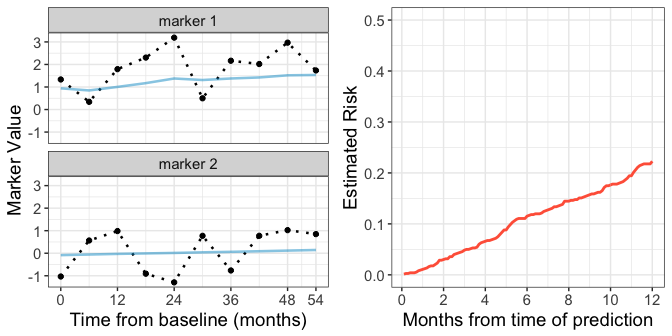

Nov 1, 2017  


#### Introduction

The `partlyconditional` R package provides model fitting procedures to fit partly conditional (PC) risk models. These models are often employed in medical contexts where long term follow-up information is available on a patient population along with repeated measures of patient health and other biological markers collected across time. Interest lies in predicting patients' risk of a future adverse outcome using longitudinal data collected up until the time of prediction. 

In the figure below, the black dotted lines in the left two panels display hypothetical marker values for a single subject collected across 54 months of patient history.  The right panel shows risk estimated using a PC model for the 'next' 12 months conditional on the observed marker trajectories. The left two panels also show 'smoothed' marker trajectories represented by blue lines. If markers are suspected to be measured with error, using smoothed marker values instead of raw marker values in a predictive model can improve model performance. Methods in this package allow for marker smoothing using mixed effect models to estimate the ['best unbiased linear predictor' (BLUP)](#blup) for each marker trajectory across time. 


---------------------

<!-- -->

-------------------

Specifically, partly conditional models predict the risk of an adverse event in the next $t_0$ time interval, given survival to time $s$, as a function of longitudinal marker history $H(s)$:  

$$
R(\tau_0 | s, H(s)) = P(T \le s + \tau_0 | T > s, H(s))
$$

Where $T$ is time until the event of interest. For the example shown above, the conditioning time is $s = 54$ months, and the prediction time $\tau_0$ ranges from 1-12 months to generate a risk curve across time. 

This package provides functions to fit two classes of partly conditional models--a 'Cox' type approach that models the conditional hazard of failure using a Cox proportional hazards model (`PC.Cox`) and a 'GLM' approach where a marginal generalized linear model is employed (`PC.GLM`).

#### PC Cox models 

The `PC.Cox` function fits a partly conditional Cox model of the form: 

$$
\lambda(\tau | H(s))  = \lambda_0(\tau) exp(\alpha B(s) + \beta Z + \gamma h(Y)) 
$$

where $\lambda_0$ is the unkown baseline hazard, $B(s)$ is a spline basis for the time of measurement, $Z$ is covariate information that is constant through time, and $h(Y)$ is a function of the marker values, such as last observed marker value or smoothed marker values. Absolute $\tau$ year estimates of risk conditional on surviving to measurement time $s$ are then calculated using the Breslow estimator.  


#### PC Logistic models 

Another flexible approach is to fit a PC glm model using `PC.GLM`. For this approach, a *marginal* generalized linear model is specified for the binary outcome defined by survival time $T$ and prediction time $\tau_0$. 


$$
P(T < \tau_0 | s, H(s))  = g( \alpha B(s) + \beta Z + \gamma h(Y)) )
$$

As before, $B(s)$ is a spline basis for the time of measurement, $Z$ is covariate information, and $h(Y)$ is a function of the marker values. In this package, we use the logistic link function for $g$. Note that since the binary outcome is defined based on the prediction time $\tau_0$,  a new marginal model must be specified for each desired future prediction time.  

Methods describing model fitting procedures that account for censored individuals are described in the [manuscript]{#ref} cited below. 

#### Smoothing marker trajectories using BLUPs. {#blup}

Before fitting a PC model, `partlyconditional` functions include procedures to first smooth a marker $Y_i$'s univariate trajectory through time by fitting mixed effect models. This is helpful for improving model performance when markers are measured with error because it borrows information about marker variation across individuals. For each marker $Y$, we model the biomarker process using a linear mixed effect model of the form: 

$$
Y_{ij} = \beta_0 + \beta_1 M_{j} + u_{0i} + u_{1i}M_j + \varepsilon_{ij}
$$

for measurement $j$ recorded from subject $i$ at measurement time $M_j$. The measurement error, $\varepsilon_{ij}$, is assumed to have a normal distribution. As shown above, we model marker trajectories using fixed intercept and linear effect of measurement time ($\beta_0$ and $\beta_1$) along with random intercepts and slopes that vary across individuals ($u_{0i}$ and $u_{1_i}$). 

To obtain smoothed marker values to use for a new prediction, we then estimate the best linear unbiased predictors (BLUPs) $\hat{h}(Y)$ by pairing the mixed effect models with raw marker values recorded up to some time $s$. 

Please see [references](#ref) below for further details. 


#### Download package

Package can be downloaded directly from Github using the `devtools` package. 


```r
library(devtools)
###install 
devtools::install_github("mdbrown/partlyconditional")
```

All package code is also available on Github [here](https://github.com/mdbrown/partlyconditional). 


#### Tutorial 

An in-depth [tutorial is available here.](http://rpubs.com/mdbrown/partlyconditional)


#### References {#ref}

Zheng YZ, Heagerty PJ. Partly conditional survival models for longitudinal data. Biometrics. 2005;61:379–391.

Maziarz, M., Heagerty, P., Cai, T. and Zheng, Y. (2017), On longitudinal prediction with time-to-event outcome: Comparison of modeling options. Biom, 73: 83–93. doi:10.1111/biom.12562
