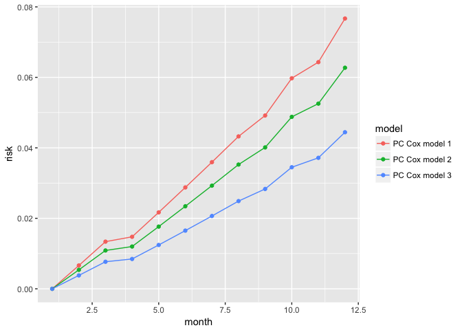

# Tutorial for R package `partlyconditional`


## Load package

```r
###install 
devtools::install_github("mdbrown/partlyconditional")
```


```r
library(partlyconditional)
```

```
## Warning: replacing previous import 'dplyr::collapse' by 'nlme::collapse'
## when loading 'partlyconditional'
```

```r
library(tidyverse)
```

```
## Loading tidyverse: ggplot2
## Loading tidyverse: tibble
## Loading tidyverse: tidyr
## Loading tidyverse: readr
## Loading tidyverse: purrr
## Loading tidyverse: dplyr
```

```
## Warning: package 'dplyr' was built under R version 3.4.2
```

```
## Conflicts with tidy packages ----------------------------------------------
```

```
## filter(): dplyr, stats
## lag():    dplyr, stats
```

## Simulated data 

```r
data(pc_data)

head(pc_data)
```

```
##    sub.id     marker meas.time       time status visit x1  x2 z1
## 1       1  1.5966568         0   9.661293      1     1  0   0  0
## 2       1  2.8376620         6   9.661293      1     2  6  36  6
## 11      2  0.6415240         0   4.571974      1     1  0   0  0
## 21      3 -0.5003165         0 103.617181      1     1  0   0  0
## 22      3  1.2697985         6 103.617181      1     2  6  36  6
## 23      3  0.6484258        12 103.617181      1     3 12 144 12
##      marker_2 log.meas.time
## 1   0.7168800      0.000000
## 2   0.7314807      1.945910
## 11  0.9021957      0.000000
## 21  1.5359251      0.000000
## 22 -1.2054431      1.945910
## 23 -1.9537152      2.564949
```


## Fit a partly conditional Cox model 


```r
pc.model.1 <-  PC.cox(
        id = "sub.id",
        stime = "time",
        status = "status",
        measurement.time = "log.meas.time",
        markers = c("marker", "marker_2"),
        data = pc_data,
        use.BLUP = c(FALSE, FALSE),
        knots.measurement.time = NA)

pc.model.1
```

```
## ### Call:
## PC.cox(id = "sub.id", stime = "time", status = "status", measurement.time = "log.meas.time", 
##     markers = c("marker", "marker_2"), data = pc_data, use.BLUP = c(FALSE, 
##         FALSE), knots.measurement.time = NA)
## 
## ### Partly conditional Cox model:
##                      coef exp(coef)   se(coef)  robust se         z
## log.meas.time -0.24889213 0.7796641 0.03373166 0.03099099 -8.031113
## marker        -0.37381000 0.6881076 0.04073710 0.05669419 -6.593444
## marker_2      -0.04877612 0.9523943 0.04497338 0.04759028 -1.024918
##                   Pr(>|z|)
## log.meas.time 9.992007e-16
## marker        4.297385e-11
## marker_2      3.054021e-01
```

```r
pc.model.1$model.fit #direct access to the coxph model object
```

```
## Call:
## coxph(formula = my.formula, data = my.data)
## 
##                  coef exp(coef) se(coef) robust se     z       p
## log.meas.time -0.2489    0.7797   0.0337    0.0310 -8.03 1.0e-15
## marker        -0.3738    0.6881   0.0407    0.0567 -6.59 4.3e-11
## marker_2      -0.0488    0.9524   0.0450    0.0476 -1.02    0.31
## 
## Likelihood ratio test=137  on 3 df, p=0
## n= 478, number of events= 436
```


### Calculate BLUPs  


```r
pc.model.2 <-  PC.cox(
        id = "sub.id",
        stime = "time",
        status = "status",
        measurement.time = "log.meas.time",
        markers = c("marker", "marker_2"),
        data = pc_data,
        use.BLUP = c(TRUE, TRUE),
        knots.measurement.time = NA)
```

```
## ...Calculating Best Linear Unbiased Predictors (BLUP's) for marker:  marker
## ...Calculating Best Linear Unbiased Predictors (BLUP's) for marker:  marker_2
```

```r
pc.model.2
```

```
## ### Call:
## PC.cox(id = "sub.id", stime = "time", status = "status", measurement.time = "log.meas.time", 
##     markers = c("marker", "marker_2"), data = pc_data, use.BLUP = c(TRUE, 
##         TRUE), knots.measurement.time = NA)
## 
## ### BLUPs fit for marker(s):  marker  marker_2 
##    See x$marker.blup.fit for details on mixed effect model fits. 
## 
## ### Partly conditional Cox model:
##                      coef exp(coef)   se(coef)  robust se         z
## log.meas.time -0.24889213 0.7796641 0.03373166 0.03099099 -8.031113
## marker_BLUP   -0.37381000 0.6881076 0.04073710 0.05669419 -6.593444
## marker_2_BLUP -0.04877612 0.9523943 0.04497338 0.04759028 -1.024918
##                   Pr(>|z|)
## log.meas.time 9.992007e-16
## marker_BLUP   4.297385e-11
## marker_2_BLUP 3.054021e-01
```

```r
#direct access to mixed effect model fits
pc.model.2$marker.blup.fit[[1]] #same for marker_2
```

```
## Linear mixed-effects model fit by REML
##   Data: my.data 
##   Log-restricted-likelihood: -764.2591
##   Fixed: as.formula(paste0(marker.name, "~ 1 +", measurement.time)) 
##   (Intercept) log.meas.time 
##    0.78506732    0.04856071 
## 
## Random effects:
##  Formula: ~1 + log.meas.time | sub.id
##  Structure: General positive-definite, Log-Cholesky parametrization
##               StdDev    Corr  
## (Intercept)   0.8638441 (Intr)
## log.meas.time 0.2196077 -0.813
## Residual      1.0707781       
## 
## Number of Observations: 478
## Number of Groups: 100
```


### Model measurement time with natural cubic splines   


```r
pc.model.3 <-  PC.cox(
        id = "sub.id",
        stime = "time",
        status = "status",
        measurement.time = "log.meas.time",
        markers = c("marker", "marker_2"),
        data = pc_data,
        use.BLUP = c(TRUE, TRUE),
        knots.measurement.time = 3) #spline with three knots
```

```
## ...Calculating Best Linear Unbiased Predictors (BLUP's) for marker:  marker
## ...Calculating Best Linear Unbiased Predictors (BLUP's) for marker:  marker_2
```

```r
pc.model.3
```

```
## ### Call:
## PC.cox(id = "sub.id", stime = "time", status = "status", measurement.time = "log.meas.time", 
##     markers = c("marker", "marker_2"), data = pc_data, use.BLUP = c(TRUE, 
##         TRUE), knots.measurement.time = 3)
## 
## ### BLUPs fit for marker(s):  marker  marker_2 
##    See x$marker.blup.fit for details on mixed effect model fits. 
## 
## ### Partly conditional Cox model:
##                                coef exp(coef)   se(coef)  robust se
## meas.time.spline.basis1 -0.49310008 0.6107301 0.21737104 0.17107720
## meas.time.spline.basis2 -0.96091472 0.3825428 0.29501547 0.21015991
## meas.time.spline.basis3 -1.22889722 0.2926151 0.17280772 0.18256689
## marker_BLUP             -0.36978430 0.6908833 0.04098477 0.05565351
## marker_2_BLUP           -0.04579483 0.9552379 0.04511473 0.04709833
##                                  z     Pr(>|z|)
## meas.time.spline.basis1 -2.8823249 3.947524e-03
## meas.time.spline.basis2 -4.5723026 4.823937e-06
## meas.time.spline.basis3 -6.7312164 1.682510e-11
## marker_BLUP             -6.6444027 3.044487e-11
## marker_2_BLUP           -0.9723238 3.308895e-01
```


## Make predictions


```r
library(dplyr)

newd <- filter(pc_data, sub.id ==9)
newd
```

```
##   sub.id      marker meas.time     time status visit x1  x2 z1   marker_2
## 1      9  1.02888372         0 20.66679      1     1  0   0  0 -1.4907630
## 2      9 -0.06781037         6 20.66679      1     2  6  36  6 -1.1421105
## 3      9  1.57139173        12 20.66679      1     3 12 144 12  0.2092991
## 4      9 -0.51085602        18 20.66679      1     4 18 324 18  0.1621595
##   log.meas.time
## 1      0.000000
## 2      1.945910
## 3      2.564949
## 4      2.944439
```

```r
myp.1 <- predict(pc.model.1 , 
                 newdata  = newd, 
                 prediction.time = c(12))
```

```
## Selecting by log.meas.time
```

```r
myp.1
```

```
##   sub.id    marker meas.time     time status visit x1  x2 z1  marker_2
## 4      9 -0.510856        18 20.66679      1     4 18 324 18 0.1621595
##   log.meas.time   risk_12
## 4      2.944439 0.1451565
```

```r
myp.2 <- predict(pc.model.2 , 
                 newdata  = newd, 
                 prediction.time = c(12))
```

```
## Selecting by log.meas.time
```

```r
myp.2
```

```
##   sub.id    marker meas.time     time status visit x1  x2 z1  marker_2
## 4      9 -0.510856        18 20.66679      1     4 18 324 18 0.1621595
##   log.meas.time marker_BLUP marker_2_BLUP    risk_12
## 4      2.944439   0.7479781   0.004693731 0.09400671
```

```r
myp.3 <- predict(pc.model.3 , 
                 newdata  = newd, 
                 prediction.time = c(12))
```

```
## Selecting by log.meas.time
```

```r
myp.3
```

```
##   sub.id    marker meas.time     time status visit x1  x2 z1  marker_2
## 4      9 -0.510856        18 20.66679      1     4 18 324 18 0.1621595
##   log.meas.time marker_BLUP marker_2_BLUP meas.time.spline.basis1
## 4      2.944439   0.7479781   0.004693731                0.603065
##   meas.time.spline.basis2 meas.time.spline.basis3   risk_12
## 4                 0.31028             -0.09130828 0.1029338
```

### Plot trajectory 


```r
newd <- filter(pc_data, sub.id ==6)
newd 
```

```
##    sub.id     marker meas.time     time status visit x1   x2 z1   marker_2
## 1       6  2.5403991         0 70.58817      1     1  0    0  0 -1.7719331
## 2       6  2.1686358         6 70.58817      1     2  6   36  6  0.9095231
## 3       6  1.4873528        12 70.58817      1     3 12  144 12 -1.8790425
## 4       6  1.1840027        18 70.58817      1     4 18  324 18 -1.3033768
## 5       6  2.0365749        24 70.58817      1     5 24  576 24  1.1747826
## 6       6  2.4162040        30 70.58817      1     6 30  900 30  0.1439847
## 7       6 -1.1915585        36 70.58817      1     7 36 1296 36  0.7195988
## 8       6  1.7346410        42 70.58817      1     8 42 1764 42  0.5300242
## 9       6  1.4934837        48 70.58817      1     9 48 2304 48  0.3501059
## 10      6  0.6553391        54 70.58817      1    10 54 2916 54 -0.3448554
##    log.meas.time
## 1       0.000000
## 2       1.945910
## 3       2.564949
## 4       2.944439
## 5       3.218876
## 6       3.433987
## 7       3.610918
## 8       3.761200
## 9       3.891820
## 10      4.007333
```

```r
#predict 1-12 month risk after 
myp.traj.1 <- predict(pc.model.1 , newdata  = newd, prediction.time = c(1:12))
```

```
## Selecting by log.meas.time
```

```r
myp.traj.2 <- predict(pc.model.2 , newdata  = newd, prediction.time = c(1:12))
```

```
## Selecting by log.meas.time
```

```r
myp.traj.3 <- predict(pc.model.3 , newdata  = newd, prediction.time = c(1:12))
```

```
## Selecting by log.meas.time
```

```r
myp.traj.1$model = "PC Cox model 1"
myp.traj.2$model = "PC Cox model 2"
myp.traj.3$model = "PC Cox model 3"

myp.traj <- bind_rows(myp.traj.1, myp.traj.2, myp.traj.3)

myp.traj %>% gather( "time_risk", "risk", risk_1:risk_12) %>% 
   select(time_risk, risk, model) %>% 
   transform(month = as.numeric(gsub("[^0-9]","", time_risk))) %>%
  ggplot(aes(x = month, y = risk, color = model)) + geom_point() + geom_path() 
```

<!-- -->


