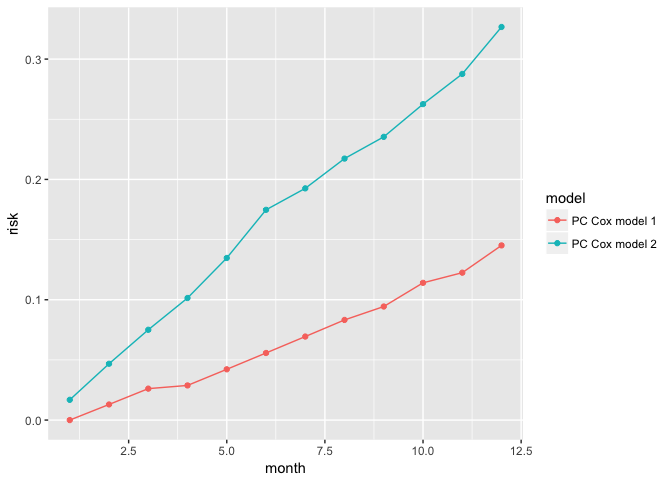

# R package `partlyconditional`
October 4, 2017  

# Introduction 


The `partlyconditional` R package provides model fitting methods for (medical) contexts where long term follow-up information is available on a patient population along with multiple measures of patient health and other biological markers collected across time. Interest lies in modeling a patients' future risk of an adverse event in the next $t_0$ time interval, given survival to time $s$, as a function of longitudinal marker history $H(s)$:  

$$
R(\tau_0 | s, H(s)) = P(T \le s + \tau_0 | T > s, H(s))
$$
Where $T$ is time until the event of interest. 

One approach is to use 'partly conditional' models, where risk is specified by first conditioning on the set of known marker history collected until time $s$. This package provides functions to fit two classes of partly conditional models; one based on logistic regression (`PC.logistic` (**coming soon**)), and another which models the conditional hazard of failure using a Cox proportional hazards model (`PC.Cox`).

#### PC Cox models 

The `PC.Cox` function fits a partly conditional Cox model of the form: 

$$
\lambda(\tau | H(s))  = \lambda_0(\tau) exp(\alpha B(s) + \beta Z + \gamma h(Y)) 
$$

where $\lambda_0$ is the unkown baseline hazard, $B(s)$ is a spline basis for the time of measurement, $Z$ includes covariate and patient information constant through time, and $h(Y)$ is a function of the marker values, such as last observed marker value or *best linear unbiased predictors* (see below). Absolute $\tau$ year estimates of risk conditional on measurement time $s$ are calculated using the Nelson-Aalen-Breslow estimator for a Cox PH model.  


#### Smoothing marker trajectories with BLUPs. 

Before fitting the PC model, functions also include procedures to smooth a marker $Y_i$'s univariate trajectory through time by fitting mixed effect models. This is helpful for improving model performance when markers are measured with error. For each marker (specified by the user), we model the biomarker process using a linear mixed effect model of the form: 

$$
Y_i = 
$$

and estimate the best linear unbiased predictors (BLUPs) $\hat{h}(Y)$ to be used to predict the event of interest. 

Please see [references](#ref) below for further details. 


#Tutorial 

### Load package

Package can be downloaded directly from Github using the `devtools` package. 


```r
library(devtools)
###install 
devtools::install_github("mdbrown/partlyconditional")
```

You can see the project code [here](https://github.com/mdbrown/partlyconditional)


```r
#load libraries
library(partlyconditional)
library(tidyverse)
```

### Simulated data 

For this tutorial, we use data on 478 simulated observations from 100 hypothetical individuals with repeated marker measurements. 'marker_1' was simulated to be associated with the outcome `status`, while 'marker_2' is pure noise. 


```r
data(pc_data)

head(pc_data)
```

```
##    sub.id       time status meas.time log.meas.time   marker_1   marker_2
## 1       1   9.661293      1         0      0.000000  1.5966568  0.7168800
## 2       1   9.661293      1         6      1.945910  2.8376620  0.7314807
## 11      2   4.571974      1         0      0.000000  0.6415240  0.9021957
## 21      3 103.617181      1         0      0.000000 -0.5003165  1.5359251
## 22      3 103.617181      1         6      1.945910  1.2697985 -1.2054431
## 23      3 103.617181      1        12      2.564949  0.6484258 -1.9537152
```

Note that `pc_data` is in 'long' format, with one row per measurement time. Each individual has a unique numeric subject id (`sub.id`) where event time (`time`) and event status (`status`) are repeated across marker measurement times (`meas.time`) given in months. `log.meas.time` is the transformation $log(s + 1)$ applied to the measurement time that we use for modeling. 


### Fit a partly conditional Cox model 


We fit the model using the transformed  `log.meas.time` and two markers. Raw marker values are used in the model as predictors since `use.BLUP` is set to `FALSE` for both markers. 


```r
pc.model.1 <-  PC.Cox(
        id = "sub.id",
        stime = "time",
        status = "status",
        measurement.time = "log.meas.time",
        markers = c("marker_1", "marker_2"),
        data = pc_data,
        use.BLUP = c(FALSE, FALSE), #no modeling of markers through time
        knots.measurement.time = NA) #no spline used 

pc.model.1
```

```
## ### Call:
## PC.Cox(id = "sub.id", stime = "time", status = "status", measurement.time = "log.meas.time", 
##     markers = c("marker_1", "marker_2"), data = pc_data, use.BLUP = c(FALSE, 
##         FALSE), knots.measurement.time = NA)
## 
## ### Partly conditional Cox model:
##                      coef exp(coef)   se(coef)  robust se         z     Pr(>|z|)
## log.meas.time -0.24889213 0.7796641 0.03373166 0.03099099 -8.031113 9.992007e-16
## marker_1      -0.37381000 0.6881076 0.04073710 0.05669419 -6.593444 4.297385e-11
## marker_2      -0.04877612 0.9523943 0.04497338 0.04759028 -1.024918 3.054021e-01
```

```r
pc.model.1$model.fit #direct access to the coxph model object
```

```
## Call:
## coxph(formula = my.formula, data = my.data)
## 
##                  coef exp(coef) se(coef) robust se     z       p
## log.meas.time -0.2489    0.7797   0.0337    0.0310 -8.03 1.0e-15
## marker_1      -0.3738    0.6881   0.0407    0.0567 -6.59 4.3e-11
## marker_2      -0.0488    0.9524   0.0450    0.0476 -1.02    0.31
## 
## Likelihood ratio test=137  on 3 df, p=0
## n= 478, number of events= 436
```

We can access the objects in the model fit by using the `$` operator, since `PC.Cox` returns a list. See `names(pc.model.1)` to see all information recorded in the model fit. 


#### Calculate BLUPs  

Instead of using raw marker values as predictors, which may have been measured with error, we first smooth marker measurements using mixed effect models univariately on each marker. We specify that BLUPs should be calculated for each marker by setting `use.BLUP = c(TRUE, TRUE)`. For this model fit, we also set `knots.measurement.time = 3` to model measurement time using natural cubic splines. 

For each marker with `use.BLUP` element equal to  `TRUE`, we model the marker as function of measurement time using: 

```r
lme(marker ~ 1 + measurement.time, random = ~ 1 + measurement.time | id)
```
and estimate *best linear unbiased predictors* BLUPs for each marker using this set of models. 


```r
pc.model.2 <-  PC.Cox(
        id = "sub.id",
        stime = "time",
        status = "status",
        measurement.time = "meas.time",
        markers = c("marker_1", "marker_2"),
        data = pc_data,
        use.BLUP = c(TRUE, TRUE), #smooth marker trajectories 
        knots.measurement.time = 3) # model measurement time using splines 
```

```
## ...Calculating Best Linear Unbiased Predictors (BLUP's) for marker:  marker_1
## ...Calculating Best Linear Unbiased Predictors (BLUP's) for marker:  marker_2
```

```r
pc.model.2
```

```
## ### Call:
## PC.Cox(id = "sub.id", stime = "time", status = "status", measurement.time = "meas.time", 
##     markers = c("marker_1", "marker_2"), data = pc_data, use.BLUP = c(TRUE, 
##         TRUE), knots.measurement.time = 3)
## 
## ### BLUPs fit for marker(s):  marker_1  marker_2 
##    See x$marker.blup.fit for details on mixed effect model fits. 
## 
## ### Partly conditional Cox model:
##                                coef exp(coef)   se(coef)  robust se          z     Pr(>|z|)
## meas.time.spline.basis1 -0.22523209 0.7983309 0.23702493 0.19289842 -1.1676202 2.429600e-01
## meas.time.spline.basis2 -0.07935234 0.9237144 0.26120392 0.18929434 -0.4192008 6.750694e-01
## meas.time.spline.basis3 -0.21490642 0.8066169 0.19258407 0.20257471 -1.0608749 2.887468e-01
## marker_1_BLUP           -0.37453287 0.6876104 0.04110525 0.05261546 -7.1183042 1.092682e-12
## marker_2_BLUP           -0.03347195 0.9670820 0.04539559 0.04160602 -0.8044979 4.211095e-01
```

```r
#direct access to mixed effect model fits
pc.model.2$marker.blup.fit[[1]] #same for marker_2
```

```
## Linear mixed-effects model fit by REML
##   Data: my.data 
##   Log-restricted-likelihood: -768.747
##   Fixed: as.formula(paste0(marker.name, "~ 1 +", measurement.time)) 
## (Intercept)   meas.time 
## 0.811834699 0.004304699 
## 
## Random effects:
##  Formula: ~1 + meas.time | sub.id
##  Structure: General positive-definite, Log-Cholesky parametrization
##             StdDev      Corr  
## (Intercept) 0.631632428 (Intr)
## meas.time   0.006125194 -0.792
## Residual    1.103872605       
## 
## Number of Observations: 478
## Number of Groups: 100
```


### Make predictions

We can now use the model fits above and `predict` the risk at fixed prediction times conditional on marker history.  We first select some patients, for whom which we would like to calculate risk conditional on up to 18 months of marker data. 


```r
# choose to make predictions for subject id 3, 9 and 74
#using marker measurements up to month 18
newd <- dplyr::filter(pc_data, is.element(sub.id, c( 3, 9, 74)), meas.time <= 18)
newd
```

```
##    sub.id      time status meas.time log.meas.time    marker_1   marker_2
## 1       3 103.61718      1         0      0.000000 -0.50031652  1.5359251
## 2       3 103.61718      1         6      1.945910  1.26979848 -1.2054431
## 3       3 103.61718      1        12      2.564949  0.64842576 -1.9537152
## 4       3 103.61718      1        18      2.944439  0.94453730 -0.4299647
## 5       9  20.66679      1         0      0.000000  1.02888372 -1.4907630
## 6       9  20.66679      1         6      1.945910 -0.06781037 -1.1421105
## 7       9  20.66679      1        12      2.564949  1.57139173  0.2092991
## 8       9  20.66679      1        18      2.944439 -0.51085602  0.1621595
## 9      74  14.28849      1         0      0.000000  2.49743739  0.1347417
## 10     74  14.28849      1         6      1.945910  2.42248176  0.6299841
## 11     74  14.28849      1        12      2.564949  1.27921103  1.1205354
```

Next, we use `predict` to estimate 12 and 24 month risk conditional on last marker time measured. 


```r
myp.1 <- predict(pc.model.1 , 
                 newdata  = newd, 
                 prediction.time = c(12, 24))
#estimate risk conditional on last recorded measurement time
#for each individual
myp.1 
```

```
##    sub.id      time status meas.time log.meas.time   marker_1   marker_2    risk_12   risk_24
## 4       3 103.61718      1        18      2.944439  0.9445373 -0.4299647 0.08943974 0.2474009
## 8       9  20.66679      1        18      2.944439 -0.5108560  0.1621595 0.14515647 0.3785883
## 11     74  14.28849      1        12      2.564949  1.2792110  1.1205354 0.08079691 0.2255214
```

`predict` produces a data.frame consisting of marker values and measurement times for the most recent marker measurement observed for each individual. Risk of experiencing the event of interested within 12 and 24 months is estimated for each individual conditional on surviving to the most recent marker measurement recorded for that individual. This means that subject 3 has an estimated 12 month risk of ~9% conditional on surviving 18 months from baseline, whereas subject 74 has a 12 month risk of ~8% conditional on surviving 12 months from baseline. 

If we make predictions from a model that includes BLUPs to smooth markers and/or splines to model measurement time, these transformations are included in the output. 


```r
myp.2 <- predict(pc.model.2 , 
                 newdata  = newd, 
                 prediction.time = c(12, 24))
#also includes information on measurement time splines and 
#marker blups 
myp.2
```

```
##    sub.id      time status meas.time log.meas.time   marker_1   marker_2 marker_1_BLUP
## 4       3 103.61718      1        18      2.944439  0.9445373 -0.4299647     0.7520612
## 8       9  20.66679      1        18      2.944439 -0.5108560  0.1621595     0.7270313
## 11     74  14.28849      1        12      2.564949  1.2792110  1.1205354     1.4246068
##    marker_2_BLUP meas.time.spline.basis1 meas.time.spline.basis2 meas.time.spline.basis3   risk_12
## 4     -0.0133941              0.17619006               0.5585725              -0.3180959 0.3242025
## 8     -0.0140955              0.17619006               0.5585725              -0.3180959 0.3266984
## 11    -0.0249262             -0.04976115               0.5904901              -0.3601734 0.2758284
##      risk_24
## 4  0.5529303
## 8  0.5563158
## 11 0.4847020
```


#### Plot risk trajectory 

Below we display some code that displays trajectory of risk for subject 9 estimated using both models. 


```r
newd <- filter(pc_data, sub.id ==9, meas.time <=18)
newd 
```

```
##   sub.id     time status meas.time log.meas.time    marker_1   marker_2
## 1      9 20.66679      1         0      0.000000  1.02888372 -1.4907630
## 2      9 20.66679      1         6      1.945910 -0.06781037 -1.1421105
## 3      9 20.66679      1        12      2.564949  1.57139173  0.2092991
## 4      9 20.66679      1        18      2.944439 -0.51085602  0.1621595
```

```r
#predict 1-12 month risk after 
myp.traj.1 <- predict(pc.model.1 , newdata  = newd, prediction.time = c(1:12))
myp.traj.2 <- predict(pc.model.2 , newdata  = newd, prediction.time = c(1:12))

myp.traj.1$model = "PC Cox model 1"
myp.traj.2$model = "PC Cox model 2"

myp.traj <- bind_rows(myp.traj.1, myp.traj.2)

myp.traj %>% gather( "time_risk", "risk", risk_1:risk_12) %>% 
   select(time_risk, risk, model) %>% 
   transform(month = as.numeric(gsub("[^0-9]","", time_risk))) %>%
  ggplot(aes(x = month, y = risk, color = model)) + geom_point() + geom_path() 
```

<!-- -->

# References {#ref}

Zheng YZ, Heagerty PJ. Partly conditional survival models for longitudinal data. Biometrics. 2005;61:379–391.

Maziarz, M., Heagerty, P., Cai, T. and Zheng, Y. (2017), On longitudinal prediction with time-to-event outcome: Comparison of modeling options. Biom, 73: 83–93. doi:10.1111/biom.12562

