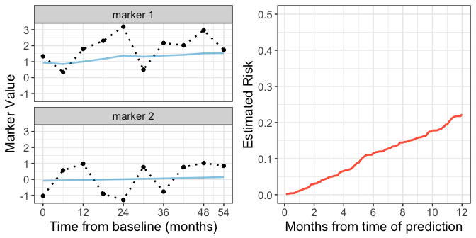

# Tutorial for R package `partlyconditional`
Nov 1, 2017  

# Introduction 


The `partlyconditional` R package provides model fitting procedures to fit partly conditional (PC) risk models. These models are often employed in medical contexts where long term follow-up information is available on a patient population along with repeated measures of patient health and other biological markers collected across time. Interest lies in predicting patients' risk of a future adverse outcome using longitudinal data collected up until the time of prediction. 

In the figure below, the black dotted lines in the left two panels display hypothetical marker values for a single subject collected across 54 months of patient history.  The right panel shows risk estimated using a PC model for the 'next' 12 months conditional on the observed marker trajectories. The left two panels also show 'smoothed' marker trajectories represented by blue lines. If markers are suspected to be measured with error, using smoothed marker values instead of raw marker values in a predictive model can improve model performance. Methods in this package allow for marker smoothing using mixed effect models to estimate the ['best unbiased linear predictor' (BLUP)](#blup) for each marker trajectory across time. 


---------------------

<!-- -->

-------------------

Specifically, partly conditional models predict the risk of an adverse event in the next $t_0$ time interval, given survival to time $s$, as a function of longitudinal marker history $H(s)$:  

$$
R(\tau_0 | s, H(s)) = P(T \le s + \tau_0 | T > s, H(s))
$$

Where $T$ is time until the event of interest. For the example shown above, the conditioning time is $s = 54$ months, and the prediction time $\tau_0$ ranges from 1-12 months to generate a risk curve across time. 

This package provides functions to fit two classes of partly conditional models--a 'Cox' type approach that models the conditional hazard of failure using a Cox proportional hazards model (`PC.Cox`) and a 'GLM' approach where a marginal generalized linear model is employed (`PC.GLM`).

#### PC Cox models 

The `PC.Cox` function fits a partly conditional Cox model of the form: 

$$
\lambda(\tau | H(s))  = \lambda_0(\tau) exp(\alpha B(s) + \beta Z + \gamma h(Y)) 
$$

where $\lambda_0$ is the unkown baseline hazard, $B(s)$ is a spline basis for the time of measurement, $Z$ is covariate information that is constant through time, and $h(Y)$ is a function of the marker values, such as last observed marker value or smoothed marker values. Absolute $\tau$ year estimates of risk conditional on surviving to measurement time $s$ are then calculated using the Breslow estimator.  


#### PC Logisitc models 

Another flexible approach is to fit a PC glm model using `PC.GLM`. For this approach, a *marginal* generalized linear model is specified for the binary outcome defined by survival time $T$ and prediction time $\tau_0$. 


$$
P(T < \tau_0 | s, H(s))  = g( \alpha B(s) + \beta Z + \gamma h(Y)) )
$$

As before, $B(s)$ is a spline basis for the time of measurement, $Z$ is covariate information, and $h(Y)$ is a function of the marker values. In this package, we use the logistic link function for $g$. Note that since the binary outcome is defined based on the prediction time $\tau_0$,  a new marginal model must be specified for each desired future prediction time.  

Methods describing model fitting procedures that account for censored individuals are described in the [manuscript]{#ref} cited below. 

#### Smoothing marker trajectories using BLUPs. {#blup}

Before fitting a PC model, `partlyconditional` functions include procedures to first smooth a marker $Y_i$'s univariate trajectory through time by fitting mixed effect models. This is helpful for improving model performance when markers are measured with error because it borrows information about marker variation across individuals. For each marker $Y$, we model the biomarker process using a linear mixed effect model of the form: 

$$
Y_{ij} = \beta_0 + \beta_1 M_{j} + u_{0i} + u_{1i}M_j + \varepsilon_{ij}
$$

for measurement $j$ recorded from subject $i$ at measurement time $M_j$. The measurement error, $\varepsilon_{ij}$, is assumed to have a normal distribution. As shown above, we model marker trajectories using fixed intercept and linear effect of measurement time ($\beta_0$ and $\beta_1$) along with random intercepts and slopes that vary across individuals ($u_{0i}$ and $u_{1_i}$). 

To obtain smoothed marker values to use for a new prediction, we then estimate the best linear unbiased predictors (BLUPs) $\hat{h}(Y)$ by pairing the mixed effect models with raw marker values recorded up to some time $s$. 

Please see [references](#ref) below for further details. 


#Tutorial 

### Load package

Package can be downloaded directly from Github using the `devtools` package. 


```r
library(devtools)
###install 
devtools::install_github("mdbrown/partlyconditional")
```

All package code is also available on Github [here](https://github.com/mdbrown/partlyconditional). 


```r
#load libraries
library(partlyconditional)
library(tidyverse)
```

### Simulated data

For this tutorial, we use data on 478 simulated observations from 100 hypothetical individuals with repeated marker measurements. 'marker_1' was simulated to be associated with the outcome `status`, while 'marker_2' is simulated to be random noise. 


```r
data(pc_data)

head(pc_data)
```

```
##    sub.id       time status meas.time log.meas.time   marker_1   marker_2
## 1       1   9.661293      1         0      0.000000  1.5966568  0.7168800
## 2       1   9.661293      1         6      1.945910  2.8376620  0.7314807
## 11      2   4.571974      1         0      0.000000  0.6415240  0.9021957
## 21      3 103.617181      1         0      0.000000 -0.5003165  1.5359251
## 22      3 103.617181      1         6      1.945910  1.2697985 -1.2054431
## 23      3 103.617181      1        12      2.564949  0.6484258 -1.9537152
```

Note that `pc_data` is in 'long' format, with one row per measurement time. Each individual has a unique numeric subject id (`sub.id`) where event time (`time`) and event status (`status`) are repeated across marker measurement times (`meas.time`) given in months. `log.meas.time` is the transformation $log(s + 1)$ applied to the measurement time used for modeling. 


### Fit a partly conditional Cox model 

The function `PC.Cox` is used to fit a PC Cox model. To specify the model, we include information on patient id (`id`), survival time (`stime`), censoring status (`status`), measurement time (`measurement.time`), and markers.  Below we fit a model using transformed  `log.meas.time` and two markers. Raw marker values are used in the model as predictors since `use.BLUP` is set to `FALSE` for both markers. 


```r
pc.cox.1 <-  PC.Cox(
        id = "sub.id",
        stime = "time",
        status = "status",
        measurement.time = "meas.time",  ##survival and measurement times must be on the same scale!!!
        markers = c("marker_1", "marker_2"),
        data = pc_data,
        use.BLUP = c(FALSE, FALSE), #no modeling of markers through time
        knots.measurement.time = NA) #no spline used for measurement time 

pc.cox.1
```

```
## ### Call:
## PC.Cox(id = "sub.id", stime = "time", status = "status", measurement.time = "meas.time", 
##     markers = c("marker_1", "marker_2"), data = pc_data, use.BLUP = c(FALSE, 
##         FALSE), knots.measurement.time = NA)
## 
## ### Partly conditional Cox model:
##                   coef exp(coef)    se(coef)  robust se          z     Pr(>|z|)
## meas.time -0.004493005 0.9955171 0.003101067 0.00341495 -1.3156868 1.882792e-01
## marker_1  -0.373143536 0.6885664 0.040885492 0.05302323 -7.0373598 1.959211e-12
## marker_2  -0.032826111 0.9677068 0.045190049 0.04232306 -0.7756081 4.379804e-01
```

```r
pc.cox.1$model.fit #direct access to the coxph model object
```

```
## Call:
## coxph(formula = my.formula, data = my.data)
## 
##               coef exp(coef) se(coef) robust se     z     p
## meas.time -0.00449   0.99552  0.00310   0.00341 -1.32  0.19
## marker_1  -0.37314   0.68857  0.04089   0.05302 -7.04 2e-12
## marker_2  -0.03283   0.96771  0.04519   0.04232 -0.78  0.44
## 
## Likelihood ratio test=90  on 3 df, p=0
## n= 478, number of events= 436
```

We can access the objects in the model fit by using the `$` operator, since `PC.Cox` returns a list. See `names(pc.cox.1)` to see all information recorded in the model fit. 


### Fit a PC GLM model 


We fit a `PC.GLM` model similarly, except that we need to also specify a future $\tau_0$ = `prediction.time` when we fit the model.  We fit a model using a spline with 2 knots for measurement time, and raw values for two markers. **


```r
pc.glm.1 <-  PC.GLM(
        id = "sub.id",
        stime = "time",
        status = "status",
        measurement.time = "meas.time",
        markers = c("marker_1", "marker_2"),
        use.BLUP = c(FALSE, FALSE), 
        prediction.time = 12,  ##survival, measurement, and prediction times must be on the same scale!!! 
        data = pc_data,
        knots.measurement.time = NA) #no spline used 

pc.glm.1
```

```
## ### Call:
## PC.GLM(id = "sub.id", stime = "time", status = "status", measurement.time = "meas.time", 
##     markers = c("marker_1", "marker_2"), data = pc_data, prediction.time = 12, 
##     use.BLUP = c(FALSE, FALSE), knots.measurement.time = NA)
## 
## ### Partly conditional Logistic model
## ###  for prediction time: 12 
##                 Estimate  Std. Error    z value     Pr(>|z|)
## (Intercept) -0.225711827 0.163160302 -1.3833747 1.665500e-01
## meas.time   -0.006133045 0.006644043 -0.9230892 3.559607e-01
## marker_1    -0.551000557 0.090460530 -6.0910605 1.121652e-09
## marker_2     0.121536241 0.099515206  1.2212831 2.219788e-01
```

```r
pc.glm.1$model.fit #direct access to the glm model object
```

```
## 
## Call:  glm(formula = fmla, family = "binomial", data = glm.data$working.dataset, 
##     weights = wgt.IPW)
## 
## Coefficients:
## (Intercept)    meas.time     marker_1     marker_2  
##   -0.225712    -0.006133    -0.551001     0.121536  
## 
## Degrees of Freedom: 473 Total (i.e. Null);  470 Residual
## Null Deviance:	    602 
## Residual Deviance: 555.1 	AIC: 549.3
```


#### Calculate BLUPs  

Instead of using raw marker values as predictors, which may have been measured with error, we can choose to first smooth marker measurements using mixed effect models fit for each marker. We specify that BLUPs should be calculated for each marker by setting `use.BLUP = c(TRUE, TRUE)`. For each marker with `use.BLUP` element equal to  `TRUE`, we model the marker as function of measurement time using: 

```r
lme(marker ~ 1 + measurement.time, random = ~ 1 + measurement.time | id)
```
and estimate *best linear unbiased predictors* BLUPs for each marker using this set of models. 

For this model fit, we also set `knots.measurement.time = 3` to model measurement time using natural cubic splines instead of a log transformation as shown above. 


```r
pc.cox.2 <-  PC.Cox(
        id = "sub.id",
        stime = "time",
        status = "status",
        measurement.time = "meas.time",
        markers = c("marker_1", "marker_2"),
        data = pc_data,
        use.BLUP = c(TRUE, TRUE), #smooth marker trajectories 
        knots.measurement.time = 2) # model measurement time using splines 
```

```
## ...Calculating Best Linear Unbiased Predictors (BLUP's) for marker:  marker_1
## ...Calculating Best Linear Unbiased Predictors (BLUP's) for marker:  marker_2
```

```r
pc.cox.2
```

```
## ### Call:
## PC.Cox(id = "sub.id", stime = "time", status = "status", measurement.time = "meas.time", 
##     markers = c("marker_1", "marker_2"), data = pc_data, use.BLUP = c(TRUE, 
##         TRUE), knots.measurement.time = 2)
## 
## ### BLUPs fit for marker(s):  marker_1  marker_2 
##    See x$marker.blup.fit for details on mixed effect model fits. 
## 
## ### Partly conditional Cox model:
##                                coef exp(coef)   se(coef)  robust se         z     Pr(>|z|)
## meas.time.spline.basis1 -0.20212150 0.8169957 0.23426095 0.20371230 -0.992191 3.211044e-01
## meas.time.spline.basis2 -0.23941353 0.7870893 0.19690425 0.20993313 -1.140428 2.541082e-01
## marker_1_BLUP           -0.37309658 0.6885987 0.04088387 0.05309220 -7.027333 2.105205e-12
## marker_2_BLUP           -0.03186082 0.9686414 0.04538564 0.04200737 -0.758458 4.481769e-01
```

We can view the individual mixed effect model fits used to smooth markers by viewing `$marker.blup.fit` from the function output. 


```r
#direct access to mixed effect model fits
pc.cox.2$marker.blup.fit[[1]] #same for marker_2
```

```
## Linear mixed-effects model fit by REML
##   Data: my.data 
##   Log-restricted-likelihood: -768.747
##   Fixed: as.formula(paste0(marker.name, "~ 1 +", measurement.time)) 
## (Intercept)   meas.time 
## 0.811834699 0.004304699 
## 
## Random effects:
##  Formula: ~1 + meas.time | sub.id
##  Structure: General positive-definite, Log-Cholesky parametrization
##             StdDev      Corr  
## (Intercept) 0.631632428 (Intr)
## meas.time   0.006125194 -0.792
## Residual    1.103872605       
## 
## Number of Observations: 478
## Number of Groups: 100
```

Fitting BLUPs for a PC GLM model is done in same way. 


```r
pc.glm.2 <-  PC.GLM(
        id = "sub.id",
        stime = "time",
        status = "status",
        measurement.time = "meas.time",
        markers = c("marker_1", "marker_2"),
        data = pc_data,
        prediction.time = 12, 
        use.BLUP = c(TRUE, TRUE), 
        knots.measurement.time = 2) # model measurement time using splines 
```

```
## ...Calculating Best Linear Unbiased Predictors (BLUP's) for marker:  marker_1
## ...Calculating Best Linear Unbiased Predictors (BLUP's) for marker:  marker_2
```

```r
pc.glm.2
```

```
## ### Call:
## PC.GLM(id = "sub.id", stime = "time", status = "status", measurement.time = "meas.time", 
##     markers = c("marker_1", "marker_2"), data = pc_data, prediction.time = 12, 
##     use.BLUP = c(TRUE, TRUE), knots.measurement.time = 2)
## 
## ### BLUPs fit for marker(s):  marker_1  marker_2 
##    See x$marker.blup.fit for details on mixed effect model fits. 
## 
## ### Partly conditional Logistic model
## ###  for prediction time: 12 
##                           Estimate Std. Error    z value     Pr(>|z|)
## (Intercept)             -0.4182982 0.20403066 -2.0501734 4.034751e-02
## meas.time.spline.basis1  0.2507704 0.51240322  0.4894005 6.245582e-01
## meas.time.spline.basis2 -0.7404380 0.43545586 -1.7003745 8.906051e-02
## marker_1_BLUP           -0.5501334 0.09027420 -6.0940267 1.101053e-09
## marker_2_BLUP            0.1311918 0.09993695  1.3127455 1.892687e-01
```

### Make predictions

We can now use the model fits above to `predict` the risk at fixed prediction times conditional on marker history.  The first step is to select new observations to calculate $\tau_0$ risk conditional on up to $s = 18$ months of marker data. 


```r
# choose to make predictions for subject id 3, 9 and 74
#using marker measurements up to month 18
newd <- dplyr::filter(pc_data, is.element(sub.id, c( 3, 9, 74, 28)), meas.time <= 18)
newd
```

```
##    sub.id      time status meas.time log.meas.time    marker_1   marker_2
## 1       3 103.61718      1         0      0.000000 -0.50031652  1.5359251
## 2       3 103.61718      1         6      1.945910  1.26979848 -1.2054431
## 3       3 103.61718      1        12      2.564949  0.64842576 -1.9537152
## 4       3 103.61718      1        18      2.944439  0.94453730 -0.4299647
## 5       9  20.66679      1         0      0.000000  1.02888372 -1.4907630
## 6       9  20.66679      1         6      1.945910 -0.06781037 -1.1421105
## 7       9  20.66679      1        12      2.564949  1.57139173  0.2092991
## 8       9  20.66679      1        18      2.944439 -0.51085602  0.1621595
## 9      28 149.51524      1         0      0.000000  1.33427278 -1.0329640
## 10     28 149.51524      1         6      1.945910  0.34167621  0.5655845
## 11     28 149.51524      1        12      2.564949  1.79141978  0.9835499
## 12     28 149.51524      1        18      2.944439  2.30550330 -0.9082704
## 13     74  14.28849      1         0      0.000000  2.49743739  0.1347417
## 14     74  14.28849      1         6      1.945910  2.42248176  0.6299841
## 15     74  14.28849      1        12      2.564949  1.27921103  1.1205354
```

Next, we use `predict` to estimate $\tau_0$ = 12 and 24 month risk conditional on last marker time measured. 


```r
risk.cox.1 <- predict(pc.cox.1, 
                 newdata  = newd, 
                 prediction.time = 12) 
#prediction time on same scale as measurement time 


#estimate risk conditional on last recorded measurement time
#for each individual
risk.cox.1 
```

```
##    sub.id      time status meas.time log.meas.time   marker_1   marker_2   risk_12
## 4       3 103.61718      1        18      2.944439  0.9445373 -0.4299647 0.3038191
## 8       9  20.66679      1        18      2.944439 -0.5108560  0.1621595 0.4573857
## 12     28 149.51524      1        18      2.944439  2.3055033 -0.9082704 0.1985935
## 15     74  14.28849      1        12      2.564949  1.2792110  1.1205354 0.2680695
```

Note that `predict` produces a data.frame consisting of marker values and measurement times for the most recent marker measurement observed for each individual. Risk of experiencing the event of interested within 12 and 24 months is estimated for each individual conditional on surviving to the most recent marker measurement recorded for that individual. This means that subject 3 has an estimated 12 month risk of ~9% conditional on surviving 18 months from baseline, whereas subject 74 has a 12 month risk of ~8% conditional on surviving 12 months from baseline. 


Making predictions for a PC GLM model is similar, except that the prediction time $\tau_0$ has already been specified to fit the model. When we fit the `pc.glm.`, a prediction time of $\tau0=12$ was used, and so 12 month risk, conditional on the last observed measurement time for each individual, is estimated. 


```r
#prediction time is already specified to fit model 
risk.glm.1 <- predict(pc.glm.1 , 
                 newdata  = newd)

risk.glm.1
```

```
##    sub.id      time status meas.time log.meas.time   marker_1   marker_2   risk_12
## 4       3 103.61718      1        18      2.944439  0.9445373 -0.4299647 0.2872447
## 8       9  20.66679      1        18      2.944439 -0.5108560  0.1621595 0.4912718
## 12     28 149.51524      1        18      2.944439  2.3055033 -0.9082704 0.1522802
## 15     74  14.28849      1        12      2.564949  1.2792110  1.1205354 0.2956771
```


Finally, if we make predictions from a model that includes BLUPs to smooth markers and/or splines to model measurement time, these transformations are included in the output. 


```r
myp.2 <- predict(pc.cox.2 , 
                 newdata  = newd, 
                 prediction.time = c(12, 24))
#also includes information on measurement time splines and 
#marker blups 
myp.2
```

```
##    sub.id      time status meas.time log.meas.time   marker_1   marker_2 marker_1_BLUP
## 4       3 103.61718      1        18      2.944439  0.9445373 -0.4299647     0.7520612
## 8       9  20.66679      1        18      2.944439 -0.5108560  0.1621595     0.7270313
## 12     28 149.51524      1        18      2.944439  2.3055033 -0.9082704     1.1716669
## 15     74  14.28849      1        12      2.564949  1.2792110  1.1205354     1.4246068
##    marker_2_BLUP meas.time.spline.basis1 meas.time.spline.basis2   risk_12   risk_24
## 4   -0.013394099               0.5056936              -0.1951669 0.3222193 0.5501239
## 8   -0.014095502               0.5056936              -0.1951669 0.3246940 0.5534909
## 12  -0.007798273               0.5056936              -0.1951669 0.2828789 0.4948532
## 15  -0.024926200               0.3908905              -0.1920981 0.2662675 0.4705279
```

```r
myp.2 <- predict(pc.glm.2 , 
                 newdata  = newd)
#also includes information on measurement time splines and 
#marker blups 
myp.2
```

```
##    sub.id      time status meas.time log.meas.time   marker_1   marker_2 marker_1_BLUP
## 4       3 103.61718      1        18      2.944439  0.9445373 -0.4299647     0.7520612
## 8       9  20.66679      1        18      2.944439 -0.5108560  0.1621595     0.7270313
## 12     28 149.51524      1        18      2.944439  2.3055033 -0.9082704     1.1716669
## 15     74  14.28849      1        12      2.564949  1.2792110  1.1205354     1.4246068
##    marker_2_BLUP meas.time.spline.basis1 meas.time.spline.basis2   risk_12
## 4   -0.013394099               0.5056936              -0.1951669 0.3629767
## 8   -0.014095502               0.5056936              -0.1951669 0.3661453
## 12  -0.007798273               0.5056936              -0.1951669 0.3116166
## 15  -0.024926200               0.3908905              -0.1920981 0.2758719
```


#### Plot risk trajectory 

Below we display the code used to plot the marker trajectory and risk for subject 28 shown as an illustrative example above. 


```r
library(tidyverse)
library(partlyconditional)
library(stringr)
data("pc_data")

#extract patient 28 marker data 
pc_data_3 <- pc_data %>% filter(sub.id == 28)

#use PC.model.frame to extract blup values 
pc_data_3_mf <- PC.model.frame(pc.cox.2, pc_data_3)

# 
plot_marker  <- pc_data_3_mf %>% 
                  gather(marker, value, 
                         marker_1, marker_2, 
                         marker_1_BLUP, marker_2_BLUP) %>%
                  transform(BLUP = grepl( "BLUP", marker),
                            marker_new = sub( "_", " ", substr(marker, 1, 8))
                  ) %>% 
  ggplot(aes(meas.time, value, 
             color = BLUP,
             linetype = BLUP, 
             alpha = BLUP, 
             shape = BLUP)) + 
    facet_wrap(~marker_new, ncol = 1) + 
    geom_path(size = .9) + 
   geom_point( ) + 
    theme_bw() + 
    ylab("Marker Value") +
    xlab("Time from baseline (months)") + 
  scale_color_manual("", values =c("Black", "deepskyblue3") ) + 
  scale_alpha_manual("", values = c(1, .5)) + 
  scale_linetype_manual("", values = c(3, 1)) + 
  scale_shape_manual("", values = c(19, NA)) + 
  theme(text =element_text(size = 14), legend.position = 'none')  + 
  scale_x_continuous(breaks = c(0, 12, 24, 36, 48, 54))


## estimate risk using predict
pc_data_3_pred <- predict(pc.cox.2, pc_data_3, prediction.time = seq(0, 12, by = .1))

plot_risk <- pc_data_3_pred %>% 
               gather( "time_risk", "risk", -c(1:12)) %>% 
               select(time_risk, risk) %>% 
               transform(month = as.numeric(str_extract(time_risk, "\\d+\\.*\\d*"))) %>%
  ggplot(aes(x = month, y = risk)) + 
  geom_path(size = 1, color = "tomato")  +
  ylim(0,.5) +   xlim(0,13) + 
  theme_bw() + 
  xlab("Months from time of prediction") +
  ylab("Estimated Risk") + 
  theme(text =element_text(size = 14), legend.position = 'none') 
```

# References {#ref}

Zheng YZ, Heagerty PJ. Partly conditional survival models for longitudinal data. Biometrics. 2005;61:379–391.

Maziarz, M., Heagerty, P., Cai, T. and Zheng, Y. (2017), On longitudinal prediction with time-to-event outcome: Comparison of modeling options. Biom, 73: 83–93. doi:10.1111/biom.12562

