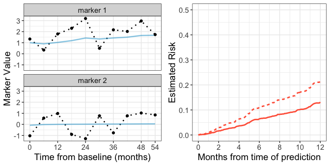

# Tutorial for R package `partlyconditional`
March 29, 2018  

# Introduction 


The `partlyconditional` R package provides model fitting procedures to fit partly conditional (PC) risk models. These models are often employed in medical contexts where long term follow-up information is available on a patient population along with repeated measures of patient health and other biological markers collected across time. Interest lies in predicting patients' risk of a future adverse outcome using data collected up until the time of prediction. 

In the figure below, the black dotted lines in the left two panels display hypothetical marker values for a single subject collected across 54 months of patient history.  The dashed line on the right panel shows risk estimated using a PC model for the 'next' 12 months conditional on all of the patient's raw marker trajectory information. The left two panels also show 'smoothed' marker trajectories represented by blue lines. If markers are suspected to be measured with error, using smoothed marker values instead of raw marker values in a predictive model can improve model performance. Risk estimated using a predictive model with smoothed marker values is shown on the right with a solid line. Methods in this package allow for marker smoothing using mixed effect models to estimate the ['best unbiased linear predictor' (BLUP)](#blup) for each marker trajectory across time. 


---------------------

<!-- -->

-------------------

Specifically, *partly conditional models* predict the risk of an adverse event in the next $t_0$ time interval, given survival to time $s$, as a function of longitudinal marker history $H(s)$:  

$$
R(\tau_0 | s, H(s)) = P(T \le s + \tau_0 | T > s, H(s))
$$

Where $T$ is time until the event of interest. For the example shown above, the conditioning time is $s = 54$ months (the last time marker information was available), and the prediction time $\tau_0$ ranges from 1-12 months to generate a risk curve across time. 

This package provides functions to fit two classes of partly conditional models--a 'Cox' approach that models the conditional hazard of failure using a Cox proportional hazards model (`PC.Cox`) and a 'GLM' approach where a marginal generalized linear model is employed (`PC.GLM`).

#### PC Cox models 

The `PC.Cox` function fits a partly conditional Cox model of the form: 

$$
\lambda(\tau | H(s))  = \lambda_0(\tau) exp(\alpha B(s) + \beta Z + \gamma h(Y)) 
$$

where $\lambda_0$ is the unkown baseline hazard, $B(s)$ represents a transformation of measurement time (such as a spline basis, or log transformation), $Z$ is covariate information that is constant through time, and $h(Y)$ is a function of the marker values, such as last observed marker value or smoothed marker values. Absolute $\tau$ year estimates of risk conditional on surviving to measurement time $s$ are then calculated using the Breslow estimator.  


#### PC Logistic models 

Another flexible approach is to fit a PC glm model using `PC.GLM`. For this approach, a *marginal* generalized linear model is specified for the binary outcome defined by survival time $T$ and prediction time $\tau_0$. 


$$
P(T < \tau_0 | s, H(s))  = g( \alpha B(s) + \beta Z + \gamma h(Y)) )
$$

As before, $B(s)$ is a transformation of measurement time, $Z$ is covariate information, and $h(Y)$ is a function of the marker values. In this package, we use the logistic link function for $g$. Note that since the binary outcome is defined based on the prediction time $\tau_0$,  a new marginal model must be specified for each desired future prediction time.  

Methods describing model fitting procedures that account for censored individuals are described in the [manuscript](#ref) cited below. 

#### Smoothing marker trajectories using BLUPs. {#blup}

Before fitting a PC model, `partlyconditional` include functions to first smooth a marker $Y_i$'s univariate trajectory through time by fitting mixed effect models. This is helpful for improving model performance when markers are measured with error because it borrows information about marker variation across individuals. For example, we may wish to model a marker $Y$ process using a simple linear mixed effect model of the form: 

$$
Y_{ij} = \beta_0 + \beta_1 M_{j} + u_{0i} + u_{1i}M_j + \varepsilon_{ij}
$$

for measurement $j$ recorded from subject $i$ at measurement time $M_j$. The measurement error, $\varepsilon_{ij}$, is assumed to have a normal distribution. As shown above, we model marker trajectories using fixed intercept and linear effect of measurement time ($\beta_0$ and $\beta_1$) along with random intercepts and slopes that vary across individuals ($u_{0i}$ and $u_{1_i}$). Functions included here allow the user to fit more complicated mixed effects model including more random/fixed covariates. 

To obtain smoothed marker values to use for a new prediction, we estimate the best linear unbiased predictors (BLUPs) $\hat{h}(Y)$ by pairing the mixed effect model with raw marker values recorded up to some time $s$. 

Please see [references](#ref) below for further details.  


#Tutorial 

### Load package

Package can be downloaded directly from Github using the `devtools` package. 


```r
library(devtools)
###install 
devtools::install_github("mdbrown/partlyconditional")
```

All package code is also available on Github [here](http://github.com/mdbrown/partlyconditional). 


```r
#load libraries
library(partlyconditional)
library(tidyverse)
```

### Simulated data

For this tutorial, we use data on 478 simulated observations from 100 hypothetical individuals with repeated marker measurements. 'marker_1' was simulated to be associated with the outcome `status`, while 'marker_2' is simulated to be random noise. 


```r
data(pc_data)

head(pc_data)
```

```
##    sub.id       time status meas.time   marker_1   marker_2
## 1       1   9.661293      1         0  1.5966568  0.7168800
## 2       1   9.661293      1         6  2.8376620  0.7314807
## 11      2   4.571974      1         0  0.6415240  0.9021957
## 21      3 103.617181      1         0 -0.5003165  1.5359251
## 22      3 103.617181      1         6  1.2697985 -1.2054431
## 23      3 103.617181      1        12  0.6484258 -1.9537152
```

Note that `pc_data` is in 'long' format, with one row per measurement time. Each individual has a unique numeric subject id (`sub.id`) where event time (`time`) and event status (`status`) are repeated across marker measurement times (`meas.time`) given in months. 

### Fit a partly conditional Cox model 

The function `PC.Cox` is used to fit a PC Cox model. To specify the model, we include information on subject id (`id`), survival time (`stime`), censoring status (`status`), measurement time (`measurement.time`), and markers.  Below we fit a model using log10 transformed `meas.time` and two markers `marker_1` and `marker_2`. 


```r
#log transform measurement time for use in models. 
pc_data$log.meas.time <- log10(pc_data$meas.time + 1)


pc.cox.1 <-  PC.Cox(
        id = "sub.id",
        stime = "time",
        status = "status",
        measurement.time = "meas.time",  ##survival time and measurement time must be on the same scale.
        predictors =c("log.meas.time", "marker_1", "marker_2"),
        data = pc_data) 

pc.cox.1
```

```
## ### Call:
## PC.Cox(id = "sub.id", stime = "time", status = "status", measurement.time = "meas.time", 
##     predictors = c("log.meas.time", "marker_1", "marker_2"), 
##     data = pc_data)
## 
## ### Partly conditional Cox model:
##                      coef exp(coef)   se(coef)  robust se          z     Pr(>|z|)
## log.meas.time -0.08239789 0.9209055 0.08138932 0.07535606 -1.0934474 2.741974e-01
## marker_1      -0.37654426 0.6862287 0.04079118 0.05390400 -6.9854599 2.839284e-12
## marker_2      -0.03448283 0.9661049 0.04526180 0.04264707 -0.8085627 4.187667e-01
```

```r
pc.cox.1$model.fit #direct access to the coxph model object
```

```
## Call:
## coxph(formula = my.formula, data = data, x = TRUE)
## 
##                  coef exp(coef) se(coef) robust se     z       p
## log.meas.time -0.0824    0.9209   0.0814    0.0754 -1.09    0.27
## marker_1      -0.3765    0.6862   0.0408    0.0539 -6.99 2.8e-12
## marker_2      -0.0345    0.9661   0.0453    0.0426 -0.81    0.42
## 
## Likelihood ratio test=88.9  on 3 df, p=0
## n= 478, number of events= 436
```

We can access the objects in the model fit by using the `$` operator, since `PC.Cox` returns a list. See `names(pc.cox.1)` to see all information recorded in the model fit. 


### Fit a PC GLM model 


We fit a `PC.GLM` model similarly, except that we need to also specify a future $\tau_0$ = `prediction.time` when we fit the model. Below we choose to fit a model that predicts the risk of the outcome 12 months in the future.  Again,  we fit a model using log transformed measurement time, and raw values for two markers.


```r
pc.glm.1 <-  PC.GLM(
        id = "sub.id",
        stime = "time",
        status = "status",
        measurement.time = "meas.time",
        predictors = c("log.meas.time", "marker_1", "marker_2"),
        prediction.time = 12,  ##survival, measurement, and prediction times must be on the same scale.
        data = pc_data) 

pc.glm.1
```

```
## ### Call:
## PC.GLM(id = "sub.id", stime = "time", status = "status", measurement.time = "meas.time", 
##     predictors = c("log.meas.time", "marker_1", "marker_2"), 
##     data = pc_data, prediction.time = 12)
## 
## ### Partly conditional Logistic model
## ###  for prediction time: 12 
##                  Estimate Std. Error     z value     Pr(>|z|)
## (Intercept)   -0.33977174 0.21239486 -1.59971734 1.096613e-01
## log.meas.time  0.01490348 0.17890975  0.08330168 9.336117e-01
## marker_1      -0.56148261 0.09045882 -6.20705197 5.398775e-10
## marker_2       0.11636490 0.09941481  1.17049870 2.418003e-01
```

```r
pc.glm.1$model.fit #direct access to the glm model object
```

```
## 
## Call:  glm(formula = fmla, family = "binomial", data = glm.data$working.dataset, 
##     weights = wgt.IPW)
## 
## Coefficients:
##   (Intercept)  log.meas.time       marker_1       marker_2  
##       -0.3398         0.0149        -0.5615         0.1164  
## 
## Degrees of Freedom: 473 Total (i.e. Null);  470 Residual
## Null Deviance:	    602 
## Residual Deviance: 555.9 	AIC: 550
```


#### Calculate BLUPs  

Instead of using raw marker values as predictors, which may have been measured with error, we can choose to first smooth marker measurements using mixed effect models fit for each marker. The function `BLUP` is used to calculate fit mixed effects models (using the `lme` function from package `nlme`). Below, we model `marker_1` using a mixed effects model including both fixed and random intercepts and fixed and random effects for log measurement time. We then estimate *best linear unbiased predictors* (BLUPs) by using `predict` to estimate BLUPs at the measurement times specified within the `newdata` provided. 


```r
myblup.marker1 <- BLUP(marker = "marker_1",  
                       measurement.time = "meas.time", 
                       fixed = c("log.meas.time"), 
                      random = c("log.meas.time"), 
                       id = "sub.id" ,      
                       data = pc_data )

#adding blup estimates to pc_data
fitted.blup.values.m1 <- predict(myblup.marker1, newdata = pc_data)

#fitted.blup.values.m1 includes the fitted blup value 
pc_data$marker_1_blup <- fitted.blup.values.m1$fitted.blup


pc.cox.2 <-  PC.Cox(
        id = "sub.id",
        stime = "time",
        status = "status",
        measurement.time = "meas.time",
        predictors = c("log.meas.time", "marker_1_blup", "marker_2"),
        data = pc_data) 
```

When `predict` is called for an object created by the function `BLUP`,  a data.frame is returned that is the same . This data.frame includes measurement time, the marker variables and also the fitted BLUP values from the above model. 


We can view the individual mixed effect model fits used to smooth markers by viewing `$model` from the `BLUP` function output. 


```r
#direct access to mixed effect model 
myblup.marker1$model 
```

```
## Linear mixed-effects model fit by REML
##   Data: data 
##   Log-restricted-likelihood: -763.425
##   Fixed: fixed.formula 
##   (Intercept) log.meas.time 
##     0.7850669     0.1118169 
## 
## Random effects:
##  Formula: ~1 + log.meas.time | sub.id
##  Structure: General positive-definite, Log-Cholesky parametrization
##               StdDev    Corr  
## (Intercept)   0.8638483 (Intr)
## log.meas.time 0.5056755 -0.813
## Residual      1.0707777       
## 
## Number of Observations: 478
## Number of Groups: 100
```

Fitting BLUPs for a PC GLM model is done in same way. 


```r
#the blup for marker 1 was previously calculated and added to 'pc_data'
pc.glm.2 <-  PC.GLM(
        id = "sub.id",
        stime = "time",
        status = "status",
        measurement.time = "meas.time",
        predictors = c("log.meas.time", "marker_1_blup", "marker_2"),
        data = pc_data,
        prediction.time = 12) # model measurement time using splines 

pc.glm.2
```

```
## ### Call:
## PC.GLM(id = "sub.id", stime = "time", status = "status", measurement.time = "meas.time", 
##     predictors = c("log.meas.time", "marker_1_blup", "marker_2"), 
##     data = pc_data, prediction.time = 12)
## 
## ### Partly conditional Logistic model
## ###  for prediction time: 12 
##                 Estimate Std. Error   z value     Pr(>|z|)
## (Intercept)    1.0622034  0.3122592  3.401672 6.697505e-04
## log.meas.time  0.5791219  0.2125995  2.724004 6.449563e-03
## marker_1_blup -2.6002212  0.3366059 -7.724823 1.120092e-14
## marker_2       0.1477155  0.1036580  1.425028 1.541492e-01
```

### Make predictions

We can now use the model fits above to `predict` the risk at fixed prediction times conditional on marker history.  The first step is to select new observations for which to calculate $\tau_0$-month risk conditional on up to $s = 24$ months of subject data. We demonstrate this below by selecting four subjects for whom we wish to make predictions. Below, we select marker data up to month 18 to be used for predictions.   


```r
# choose to make predictions for subject id 3, 9 and 74, 28
#using marker measurements up to month 24
newd <- dplyr::filter(pc_data, 
                      is.element(sub.id, c( 3, 9, 13, 28)), 
                      meas.time <= 18) 

newd
```

```
##    sub.id      time status meas.time    marker_1   marker_2 log.meas.time marker_1_blup
## 1       3 103.61718      1         0 -0.50031652  1.5359251      0.000000     0.2783058
## 2       3 103.61718      1         6  1.26979848 -1.2054431      0.845098     0.6896794
## 3       3 103.61718      1        12  0.64842576 -1.9537152      1.113943     0.7599670
## 4       3 103.61718      1        18  0.94453730 -0.4299647      1.278754     0.8293829
## 5       9  20.66679      1         0  1.02888372 -1.4907630      0.000000     0.8811915
## 6       9  20.66679      1         6 -0.06781037 -1.1421105      0.845098     0.7731314
## 7       9  20.66679      1        12  1.57139173  0.2092991      1.113943     0.9040240
## 8       9  20.66679      1        18 -0.51085602  0.1621595      1.278754     0.7479773
## 9      13  53.10317      1         0  3.39818371 -1.8174005      0.000000     1.8152855
## 10     13  53.10317      1         6  3.02961521  0.1723658      0.845098     1.7456724
## 11     13  53.10317      1        12  2.16985706  0.1379422      1.113943     1.6993292
## 12     13  53.10317      1        18 -0.62339816  0.8148837      1.278754     1.3537189
## 13     28 149.51524      1         0  1.33427278 -1.0329640      0.000000     1.0015908
## 14     28 149.51524      1         6  0.34167621  0.5655845      0.845098     0.9001575
## 15     28 149.51524      1        12  1.79141978  0.9835499      1.113943     1.0268658
## 16     28 149.51524      1        18  2.30550330 -0.9082704      1.278754     1.1876927
```

The `predict` function takes in a pc model object, newdata and a landmark prediction time to specify how far in the future predictions should be made. For a pc-glm model, this landmark time has been previously specified in the call to PC.GLM. 

Calling `predict` on a pc-model object generates estimates of risk at a future time `prediction.time`  *conditional on observing the measurement time specified in each row*. Below we specify this time to be 12 and 24 months. 


```r
risk.cox <- predict(pc.cox.2, 
                    newdata = newd, 
                    prediction.time = c(12, 24))

#only select a few columns for better printing 
risk.cox[, c("sub.id", "meas.time", 
             "marker_1", "marker_2", 
             "risk_12", "risk_24" )]
```

```
##    sub.id meas.time    marker_1   marker_2    risk_12   risk_24
## 1       3         0 -0.50031652  1.5359251 0.51394325 0.7830346
## 2       3         6  1.26979848 -1.2054431 0.42012457 0.6846931
## 3       3        12  0.64842576 -1.9537152 0.42132719 0.6860765
## 4       3        18  0.94453730 -0.4299647 0.38991987 0.6488919
## 5       9         0  1.02888372 -1.4907630 0.26081966 0.4727602
## 6       9         6 -0.06781037 -1.1421105 0.37867163 0.6350393
## 7       9        12  1.57139173  0.2092991 0.33374712 0.5768829
## 8       9        18 -0.51085602  0.1621595 0.42454870 0.6897665
## 9      13         0  3.39818371 -1.8174005 0.06621480 0.1350681
## 10     13         6  3.02961521  0.1723658 0.09188486 0.1846562
## 11     13        12  2.16985706  0.1379422 0.10776935 0.2145680
## 12     13        18 -0.62339816  0.8148837 0.18572189 0.3528378
## 13     28         0  1.33427278 -1.0329640 0.21786836 0.4057592
## 14     28         6  0.34167621  0.5655845 0.30804686 0.5415668
## 15     28        12  1.79141978  0.9835499 0.27795967 0.4983191
## 16     28        18  2.30550330 -0.9082704 0.24629207 0.4505714
```

We see in the function outputs a data.frame matching `newdata` with new added columns `risk_12`  and `risk_24`. These columns provide the risk of experiencing the event of interested within 12 and 24 months (resp.) for each individual conditional on surviving to the marker measurement recorded for that row. For example, subject 3 has an estimated 12 month risk of ~29.8% conditional on surviving 18 months from baseline, whereas subject 9 has a 12 month risk of ~24.2% conditional on surviving 12 months from baseline. 


Making predictions for a PC GLM model is similar, except that the prediction time $\tau_0$ has already been specified to fit the model. When we fit the `pc.glm.`, a prediction time of $\tau0=12$ was used, and so 12 month risk, conditional on the observed measurement time shown in each row for each individual, is estimated. 


```r
#prediction time is already specified to fit model 
risk.glm  <- predict(pc.glm.2, 
                      newdata  = newd)

#only select a few columns for better printing
risk.glm[, c("sub.id", "meas.time", 
             "marker_1_blup", "marker_2", 
             "risk_12" )] 
```

```
##    sub.id meas.time marker_1_blup   marker_2    risk_12
## 1       3         0     0.2783058  1.5359251 0.63770723
## 2       3         6     0.6896794 -1.2054431 0.39657334
## 3       3        12     0.7599670 -1.9537152 0.36415760
## 4       3        18     0.8293829 -0.4299647 0.39715491
## 5       9         0     0.8811915 -1.4907630 0.19010962
## 6       9         6     0.7731314 -1.1421105 0.34809989
## 7       9        12     0.9040240  0.2092991 0.35150433
## 8       9        18     0.7479773  0.1621595 0.47048555
## 9      13         0     1.8152855 -1.8174005 0.01933339
## 10     13         6     1.7456724  0.1723658 0.04916984
## 11     13        12     1.6993292  0.1379422 0.06350990
## 12     13        18     1.3537189  0.8148837 0.16842374
## 13     28         0     1.0015908 -1.0329640 0.15515364
## 14     28         6     0.9001575  0.5655845 0.33060613
## 15     28        12     1.0268658  0.9835499 0.30629877
## 16     28        18     1.1876927 -0.9082704 0.19471303
```


#### Plot risk trajectory 

Below we display the code used to plot the marker trajectory and risk for subject 28 shown as an illustrative example above. 


```r
library(tidyverse)
library(partlyconditional)
library(stringr)
data("pc_data")

#extract subject 28 marker data 

pc_data$log.meas.time <- log10(pc_data$meas.time + 1)


#obtain blup for marker 1 
blup.marker1 <- BLUP(marker = "marker_1",  
                       measurement.time = "meas.time", 
                       fixed = c("log.meas.time"), 
                       random = c("log.meas.time"), 
                       id = "sub.id" ,      
                       data = pc_data )

pc_data$marker_1_blup <- predict(blup.marker1, newdata = pc_data)$fitted

#obtain blup for marker 2 
blup.marker2 <- BLUP(marker = "marker_2",  
                       measurement.time = "meas.time", 
                       fixed = c("log.meas.time"), 
                       random = c("log.meas.time"), 
                       id = "sub.id" ,      
                       data = pc_data )

pc_data$marker_2_blup <- predict(blup.marker2, newdata = pc_data)$fitted


pc.cox.2 <-  PC.Cox(
        id = "sub.id",
        stime = "time",
        status = "status",
        measurement.time = "meas.time",
        predictors  = c("log.meas.time", "marker_1", "marker_2"),
        data = pc_data) # model measurement time using splines 


pc_data_3 <- pc_data %>% filter(sub.id == 28)

plot_marker <- pc_data_3 %>% 
  gather(marker, value, marker_1, marker_2, marker_1_blup, marker_2_blup) %>%
  transform(BLUP = grepl( "blup", marker),
            marker_new = sub( "_", " ", substr(marker, 1, 8))
            ) %>% 
  ggplot(aes(meas.time, value, 
             color = BLUP,
             linetype = BLUP, 
             alpha = BLUP, 
             shape = BLUP)) + 
    facet_wrap(~marker_new, ncol = 1) + 
    geom_path(size = .9) + 
   geom_point( ) + 
    theme_bw() + 
    ylab("Marker Value") +
    xlab("Time from baseline (months)") + 
  scale_color_manual("", values =c("Black", "deepskyblue3") ) + 
  scale_alpha_manual("", values = c(1, .5)) + 
  scale_linetype_manual("", values = c(3, 1)) + 
  scale_shape_manual("", values = c(19, NA)) + 
  theme(text =element_text(size = 14), legend.position = 'none')  + 
  scale_x_continuous(breaks = c(0, 12, 24, 36, 48, 54))

pc_data_3_pred <- predict(pc.cox.2,  
                          filter(pc_data_3, meas.time == 54),
                          prediction.time =  seq(0, 12, by = .1)) %>% 
  gather( "time_risk", "risk", -c(1:10)) %>% 
   select(time_risk, raw = risk)

pc_data_3_pred_w_blup <-  predict(pc.cox.3,  
                          filter(pc_data_3, meas.time == 54),
                          prediction.time =  seq(0, 12, by = .1)) %>% 
  gather( "time_risk", "risk", -c(1:10)) %>% 
   select(time_risk, blup = risk)


plot_risk <- left_join(pc_data_3_pred,
              pc_data_3_pred_w_blup,
              by = "time_risk") %>%
  gather(model, risk, raw, blup) %>%
   #gather( "time_risk", "risk", -c(1:10)) %>% 
  # select(time_risk, risk) %>% 
   transform(month = as.numeric(str_extract(time_risk, "\\d+\\.*\\d*"))) %>%
  ggplot(aes(x = month, y = risk)) + 
  geom_path(size = 1, color = "tomato", aes(linetype = model))  +
  ylim(0,.5) +   
    theme_bw() + 
    xlab("Months from time of prediction") +
    ylab("Estimated Risk") + 
  theme(text =element_text(size = 14), legend.position = 'none')  + 
  scale_x_continuous(breaks = c(0, 2, 4, 6, 8, 10, 12))
```

# References {#ref}

Zheng YZ, Heagerty PJ. Partly conditional survival models for longitudinal data. Biometrics. 2005;61:379–391.

Maziarz, M., Heagerty, P., Cai, T. and Zheng, Y. (2017), On longitudinal prediction with time-to-event outcome: Comparison of modeling options. Biom, 73: 83–93. doi:10.1111/biom.12562

